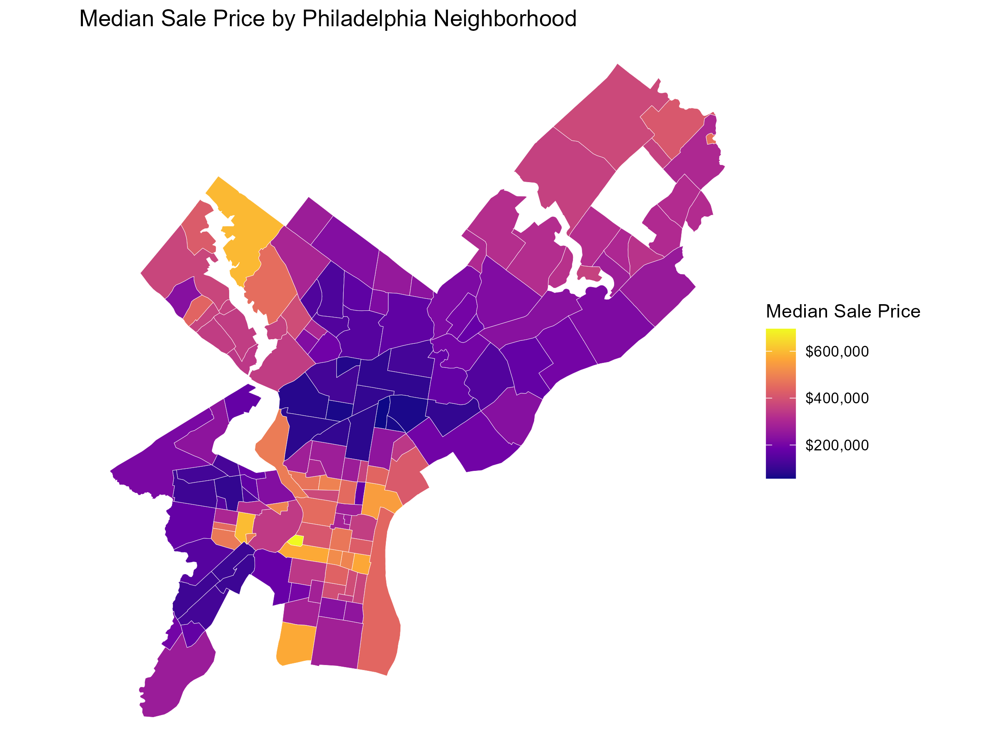
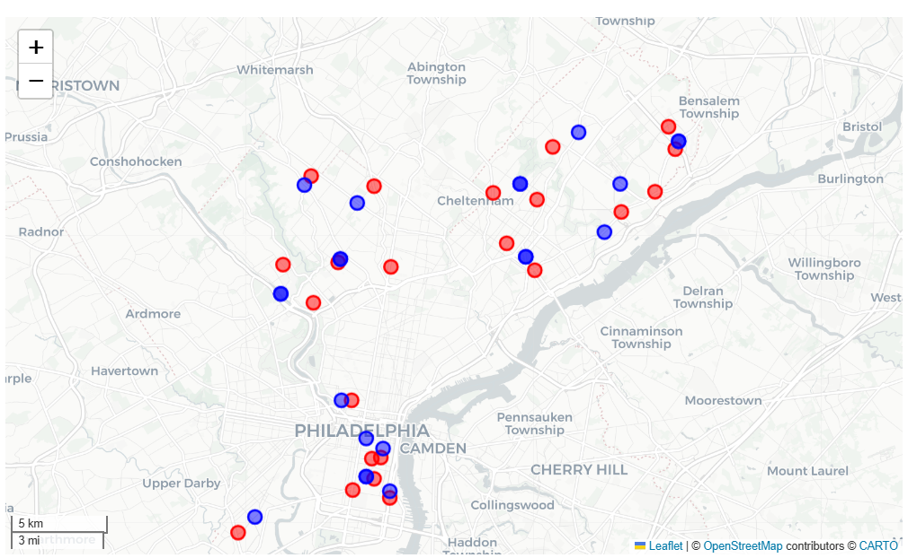
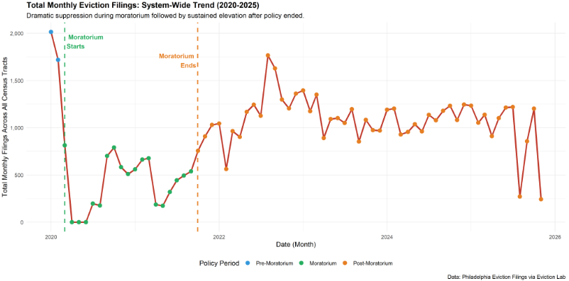
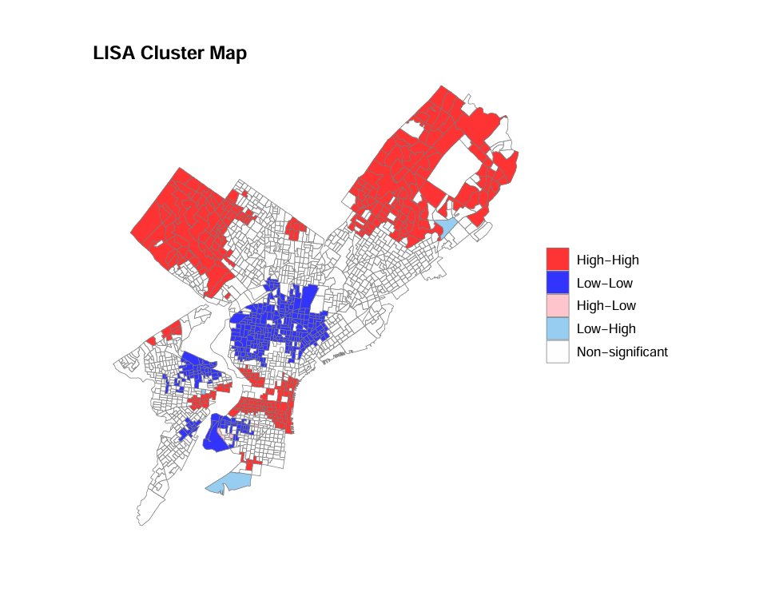

# Hi, I'm Angel Rutherford!

```{=html}


  
  <small class="text-body-secondary">ABOUT ME</small>
  
    <p class="text-primary-emphasis" style="margin-top:1rem;">I spent the past year thinking I was completely diverging from the theoretical and socio‑historical training I received in Boston University’s Bachelors of Sociology program by immersing myself in programming, spatial analysis, and statistical modeling. I learned that these tools still demanded the same depth of theory, context, and interpretation to be used responsibly.
</p>

     <p class="text-primary-emphasis" style="margin-top:0.5rem:">As a Master of Urban Spatial Analytics student at the University of Pennsylvania (Class of ’26), my work sits at the intersection of data, design, and social and political implications. I focus on end‑to‑end analysis building datasets, selecting appropriate spatial or statistical methods, and spending as much time crafting visualizations and narratives that make complexity legible without losing nuance.
</p>
  

```


```{=html}
<div class="text-center">
  <small class="text-body-secondary" style="display:block; clear:both; margin-top:5rem;"> CONTACT ME OR LEARN MORE </small>
</div>
```


```{=html}


<div class="text-center">
  <div class="btn-group" role="group" style="margin-top:1.25rem";>
    <a href="https://www.linkedin.com/in/angel-rutherford" class="btn btn-outline-dark  me-2">
      <i class="bi bi-linkedin"></i> LinkedIn
    </a>
    <a href="https://github.com/aruth3" class="btn btn-outline-dark me-2">
      <i class="bi bi-github"></i> Github
    </a>
    <a href="mailto:aruth3@design.upenn.edu" class="btn btn-outline-dark ">
      <i class="bi bi-envelope"></i> Email
    </a>
  </div>
</div>

  
```

## Projects

```{=html}

<div class="quarto-listing quarto-listing-container-grid">
  <div class="list grid quarto-list-grid">
    
    <!-- Project 1 -->
    <div class="g-col-12 g-col-md-6 g-col-md-6">
      <a href="Projects/assignment_3(midterm)/Rutherford_Angel_Appendix.qmd" 
         class="text-decoration-none" 
         style="color: inherit;">
        <div class="card h-100 hover-card">
          
          <div class="card-body">
            <h5 class="card-title">Philadelphia Housing Price Prediction</h5>
            <span class="badge rounded-pill bg-dark">R</span>
            <span class="badge rounded-pill bg-light">Linear Regression</span>
            <span class="badge rounded-pill bg-light">Feature Engineering</span>
            <span class="badge rounded-pill bg-light">Cross-Validation</span>
            <p class="card-text"> Predicting Philadelphia housing prices using a linear regression model built from spatial features, census demographics, and property characteristics </p>
          </div>
        </div>
      </a>
    </div>
    
    <!-- Project 2 -->
    <div class="g-col-12 g-col-md-6 g-col-md-6">
      <a href="Projects/final_project/Rutherford_Angel_Final_Project.ipynb" 
         class="text-decoration-none" 
         style="color: inherit;">
        <div class="card h-100 hover-card">
          
          <div class="card-body">
            <h5 class="card-title">Measuring Pharmacy Access in Philadelphia</h5>
            <span class="badge rounded-pill bg-dark">Python</span>
            <span class="badge rounded-pill bg-light">Buffer Analysis</span>
            <span class="badge rounded-pill bg-light">Network Analysis</span>
            <p class="card-text"> Creating a dataset from scratch through web scraping and API's in order to analyze changes in distance-based access to pharmacies amid mass closures</p>
          </div>
        </div>
      </a>
    </div>
    
    <!-- Project 3 -->
    <div class="g-col-12 g-col-md-6 g-col-md-6">
      <a href="Projects/shark-tank/Angel.qmd" 
         class="text-decoration-none" 
         style="color: inherit;">
        <div class="card h-100 hover-card">
          
          <div class="card-body">
            <h5 class="card-title">Eviction Risk Prediction Model</h5>
             <span class="badge rounded-pill bg-dark">R</span>
            <span class="badge rounded-pill bg-light">Negative Binomial Regression</span>
            <p class="card-text">Forecasting monthly eviction filings at the census tract level using a Negative Binomial regression model built from temporal, spatial, and socioeconomic indicators </p>
          </div>
        </div>
      </a>
    </div>

    <!-- Project 4 -->
        <div class="g-col-12 g-col-md-6 g-col-md-6">
          <a href="assignments/assignment_4/Rutherford_Angel_Assignment4.html" 
             class="text-decoration-none" 
             style="color: inherit;">
            <div class="card h-100 hover-card">
              
              <div class="card-body">
                <h5 class="card-title">Using Spatial Regression To Predict Median House Values</h5>
                 <span class="badge rounded-pill bg-dark">R</span>
                <span class="badge rounded-pill bg-light">Spatial Regression</span>
                <span class="badge rounded-pill bg-light">Moran's I</span>
                <p class="card-text">Evaluating spatial regression methods (Spatial Lag, Spatial Error, GWR) as alternatives to OLS for predicting spatially autocorrelated housing values</p>
              </div>
            </div>
          </a>
        </div>
    
  </div>
</div>

<style>
.hover-card {
  transition: transform 0.2s, box-shadow 0.2s;
}
.hover-card:hover {
  transform: translateY(-5px);
  box-shadow: 0 4px 12px rgba(0,0,0,0.15);
}
</style>

```


